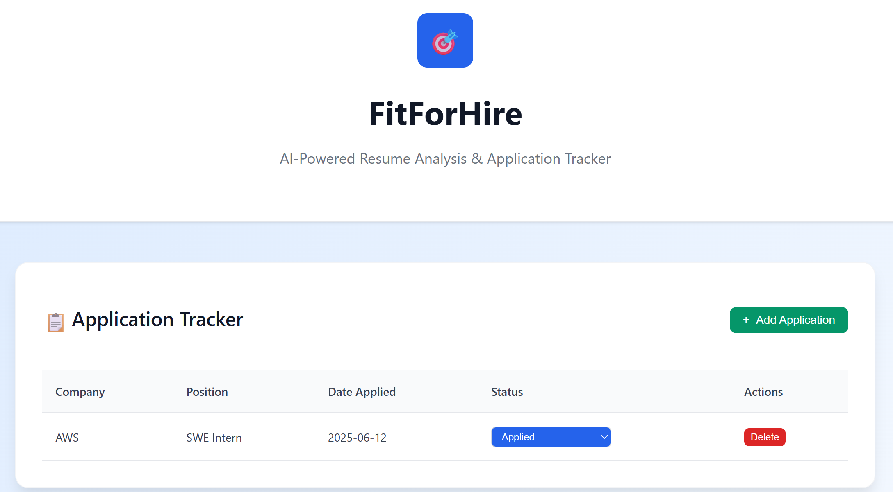
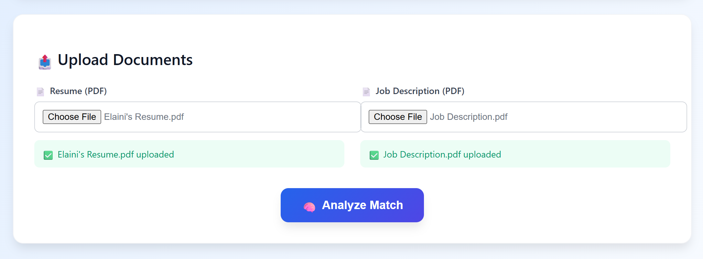
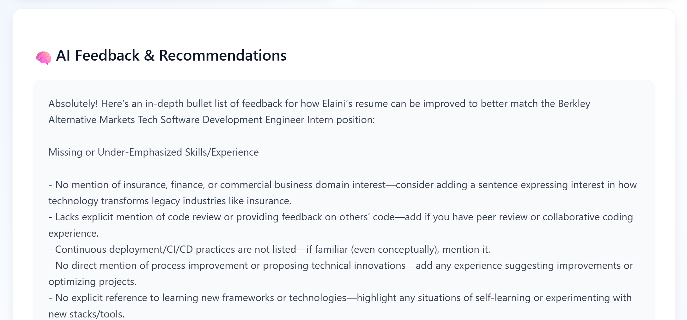

# FitForHire

FitForHire is an AI-powered job application assistant that helps job seekers optimize their resumes by matching it with a job description. It provides personalized feedback on how to improve the resume, highlights missing skills, and helps track job applications — all in one user-friendly platform.

---

## Features

- **AI Resume Feedback**  
  Upload your resume and job description in a pdf to get detailed, AI-generated suggestions to better tailor your resume for each job.
  
- **Keyword Extraction & Matching**  
  Uses spaCy NLP to extract keywords and skills from job descriptions and compare them against your resume content.
  
- **Application Tracker**  
  Keep track of all your job applications, statuses, and notes, helping you stay organized throughout your job search.
  
- **File Handling**  
  Supports PDF resume uploads and parsing using `pdfplumber`.
  
- **User-Friendly GUI**  
  Built with React.js and TailwindCSS for an intuitive and responsive front-end experience.

---

## Tools & Technologies Used

- **Programming Languages & Frameworks:**  
  - Python (Flask for backend API)  
  - JavaScript (React.js for frontend)

- **AI & NLP:**  
  - OpenAI API (Azure OpenAI client)  
  - spaCy (Natural Language Processing)

- **File Handling:**  
  - `pdfplumber` for extracting text from PDF resumes

- **Development Environment:**  
  - Visual Studio Code (VSCode)

---
## Screenshots






---

## Getting Started

### Prerequisites

- Python 3.8+  
- Node.js and npm  
- OpenAI or Azure OpenAI API key  
- Git

### Installation & Setup

1. **Clone the repository**
    ```bash
    git clone https://github.com/elaini-geffa/FitForHire.git
    cd FitForHire/backend
    ```

2. **Set up backend environment**
    ```bash
    python -m venv venv
    # Activate virtual environment:
    # Windows:
    venv\Scripts\activate
    # macOS/Linux:
    source venv/bin/activate

    pip install -r requirements.txt
    python -m spacy download en_core_web_sm
    ```

3. **Create environment variables file**  
   In the `backend` directory, create a `.env` file and add your API keys:
    ```
    GITHUB_TOKEN=your_openai_api_key_here
    ```

4. **Set up frontend**
    ```bash
    cd ../frontend
    npm install
    npm start
    ```

### Running the Application

- **Start backend server** (in one terminal)
    ```bash
    cd backend
    venv\Scripts\activate
    python app.py
    ```

- **Start frontend development server** (in another terminal)
    ```bash
    cd frontend
    npm start
    ```

- Open your browser at `http://localhost:3000` to use the app.

---

## Usage

1. Upload your resume (PDF supported).  
2. Upload a job description.  
3. Get detailed AI feedback to improve your resume tailored to the job.  
4. Track your job applications and update statuses in the application tracker.

---

## Contact

Created by Elaini Geffa  
[LinkedIn](https://www.linkedin.com/in/elainigeffa)